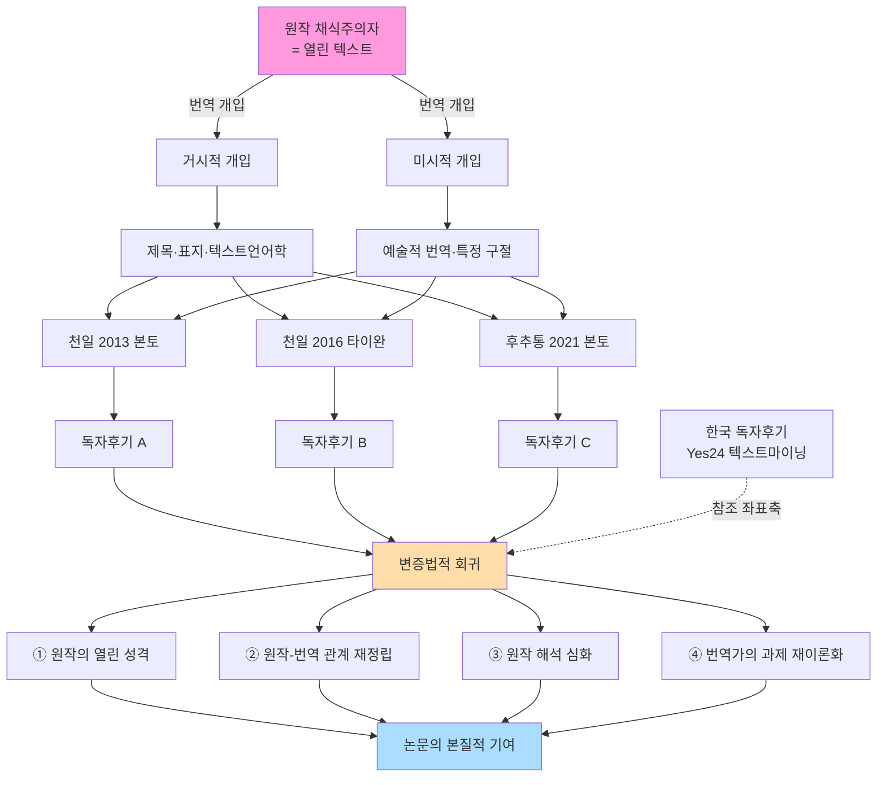

# 논문의 변증법적 회로 — 관계도 및 방법론 이미지

작성일: 2026-09-03
지위: 지도교수 협의 대기
근거: 사용자 Q1~Q4 답변 반영

---

## 확정된 답변 (사용자 답변 반영)

| # | 답 | 도표 의미 |
|---|-----|-----------|
| Q1 회귀 성격 | E (4중 조합) | 논문 도착점 = 4개 조명 통합 |
| Q2 핵심 관계 | 번역↔독자후기 (텍마+질적 모두) | 도표 중심 노드 |
| Q3 거시/미시 재정의 | 거시=제목·표지·텍스트언어학 / 미시=예술적 번역·특정 구절 | 챕터 구조와 정확히 대응 |
| Q4 한국 baseline | 참조 좌표 + 텍스트마이닝 대상 | 도표에 별도 노드 |

---

## 도표 1: 변증법적 회귀 회로 (메인 관계도)

```
                          ╔═══════════════════════════════════╗
                          ║   원작 『채식주의자』 (한강, 2007)   ║
                          ║        = 열린 텍스트 (Iser)         ║
                          ╚═══════════════════════════════════╝
                                        │
                                        │  [단계 1] 번역 개입
                                        ▼
                    ┌──────────────────────────────────────┐
                    │                                      │
              【거시적 개입】                          【미시적 개입】
              ┌──────────┐                          ┌──────────┐
              │ 제목·표지    │                          │ 예술적 번역  │
              │ 표제어       │                          │ 특정 구절    │
              │ 텍스트언어학  │                          │ 어휘 선택    │
              └──────────┘                          └──────────┘
                    │                                      │
                    └───────────┬──────────────────────────┘
                                ▼
                ┌───────────────┼───────────────┐
                │               │               │
         ╔═════════╗     ╔═════════╗     ╔═════════╗
         ║ 천일 2013  ║     ║ 천일 2016  ║     ║ 후추통 2021║
         ║ (본토·검열) ║     ║ (타이완·복원)║     ║ (본토·대안) ║
         ╚═════════╝     ╚═════════╝     ╚═════════╝
                │               │               │
                │  [단계 2] 독자 수용 (더우반)     │
                ▼               ▼               ▼
           [독자후기 A]     [독자후기 B]      [독자후기 C]
                │               │               │
                └───────────────┼───────────────┘
                                │
                       ◀── [참조 좌표축] ──▶
                                │
                       [한국 독자후기 (Yes24)]
                       ← 텍스트마이닝 대상 (Q4) →
                                │
                                │  [단계 3] 변증법적 회귀
                                ▼
              ╔═══════════════════════════════════╗
              ║          4중 조명 (Q1 E)          ║
              ║                                   ║
              ║  ①원작의 열린 성격을 새롭게 조명     ║
              ║  ②원작-번역 관계를 재정립           ║
              ║  ③원작 해석을 심화                 ║
              ║  ④이 시대 번역가의 과제를 재이론화    ║
              ╚═══════════════════════════════════╝
                                │
                                ▼
              ╔═══════════════════════════════════╗
              ║  【논문의 본질적 기여】              ║
              ║   4중 조명의 통합적 종합             ║
              ║   = 문학 번역 수용론의 새 지평       ║
              ╚═══════════════════════════════════╝
```

---

## 도표 2: 거시 / 미시 새 정의 매핑

```
┌────────────────────────────────────────────────────────────────┐
│                    【번역 개입의 두 차원】                        │
├────────────────────────────────────┬───────────────────────────┤
│         거시적 (Macro)              │        미시적 (Micro)      │
│    ── 구조적·프레임적 개입 ──         │    ── 개별 요소적 개입 ──   │
├────────────────────────────────────┼───────────────────────────┤
│  ▸ 제목 번역 (D5)                   │  ▸ 예술적 번역 (D11)       │
│    素食主义者 vs 素食者               │    원문 해석 불확정성       │
│                                    │    (몽고반점·나무되기 등)    │
│  ▸ 표지 디자인                       │                           │
│    (기호학적 신화 층)                 │  ▸ 특정 구절 번역 선택       │
│                                    │    (인물 호칭·상징 표현)     │
│  ▸ 표제어 (파라텍스트)                │                           │
│    "정신질환자로서의 관능의 세계"       │  ▸ 미시적 어휘 선택         │
│                                    │                           │
│  ▸ 텍스트언어학적 전체 구조            │                           │
│    - 응결성·응집성                    │                           │
│    - 검열의 규범적 개입                │                           │
├────────────────────────────────────┼───────────────────────────┤
│         【해당 챕터】                 │         【해당 챕터】       │
│  Ch 4  검열 (SRQ1)                 │  Ch 6.5 원문 해석 불확정성   │
│  Ch 5  파라텍스트 (SRQ2)             │  Ch 6.3 부분적 (특징어)     │
│  Ch 6.4  제목 케이스                 │                           │
└────────────────────────────────────┴───────────────────────────┘
```

**흥미로운 발견**: 논문 대부분(Ch 4·5·6.4)이 거시 분석, Ch 6.5가 유일한 심층 미시 분석. 이 비율 재검토 여지.

---

## 도표 3: 방법론 이미지 — 3층 삼각 분석의 관계별 적용

```
                         ● 원작 ●
                          │  ▲
                          │  │
              [텍스트 대조]│  │[한국 baseline 텍스트마이닝]
                 (거시·미시) │  │
                          ▼  │
                    ● 번역 ●  │
                       │      │
    ┌──────────────────┤      │
    │                  │      │
[텍스트마이닝]      [질적 코딩] │
    │  (Q2: 정량)     │(Q2: 정성)│
    ▼                  ▼      │
    ●─── 독자후기 ────●         │
                 │            │
                 └────────────●
                       │
                [철학적 해석 (회귀)]
                       │
                       ▼
                ┌──────────────┐
                │  4중 조명     │
                │  (Q1 E)      │
                └──────────────┘

━━━━━━━━━━━━━━━━━━━━━━━━━━━━━━━━━━━━━━━━━
【각 관계에 적용된 층위】

▸ 원작 ↔ 번역:      Layer 1 준하는 텍스트 대조 (거시·미시)
▸ 번역 ↔ 독자후기:   Layer 1 텍스트마이닝 + Layer 2 질적 코딩 ⭐(핵심)
▸ 원작 ↔ 독자후기:   한국 독자후기 텍스트마이닝 (참조 좌표)
▸ 회귀 (Ch 7):     Layer 3 철학적 해석
━━━━━━━━━━━━━━━━━━━━━━━━━━━━━━━━━━━━━━━━━
```

---

## 도표 4: 4중 조명 = 논문 기여의 4개 얼굴

```
                    【변증법적 회귀의 4중 조명】
                    
              ┌──────────────────────┐
              │  ① 원작의 열린 성격     │
              │     증명               │
              │  (텍스트 존재론 층위)    │
              │  Iser 빈자리·Lotman   │
              │  예술적 번역 이론화     │
              └──────────────────────┘
                        ▲
                        │
    ┌───────────────────┼───────────────────┐
    │                   │                   │
    ▼                   │                   ▼
┌──────────────┐        │        ┌──────────────┐
│ ② 원작-번역   │        │        │ ③ 원작 해석   │
│    관계 재정립  │────── ● ──────│    심화       │
│              │        │        │              │
│ 번역의 이데   │  본질적  │        │ 독자후기가    │
│ 올로기적 개입 │   기여   │        │ 원작을 조명   │
│ (Toury 규범· │        │        │              │
│  Barthes)   │        │        │              │
└──────────────┘        │        └──────────────┘
                        │
                        ▼
              ┌──────────────────────┐
              │  ④ 번역가의 과제        │
              │    재이론화             │
              │                       │
              │  Benjamin(1923) →     │
              │  2027 재답변           │
              │  (디지털 시대의 번역가)  │
              └──────────────────────┘


【네 조명의 통합 지점 = 논문의 본질적 기여】

    "번역 개입은 원작의 열린 성격을 특정 방식으로 
     굴절시켜 독자수용에 새 지형을 열며,
     그 회귀에서 원작 자체가 재조명되고,
     이는 이 시대 번역가의 과제를 재정의한다."
```

---

## 도표 5: 요약 회로 (한 페이지 총괄)

```
        ┌─────────────────────────────────────────────┐
        │                                             │
        │        원작                                 │
        │         │                                   │
        │         │ 거시(제목·표지·구조)                │
        │         │ 미시(예술적 번역·특정 구절)          │
        │         ▼                                   │
        │      번역 3본 ─ 텍마+질적 ─▶ 독자후기 3세트   │
        │         ▲                        │          │
        │         │                        │          │
        │         │◀───── 한국 독자후기 ────┘          │
        │         │       (텍마 참조)                 │
        │         │                                   │
        │         │  [변증법적 회귀]                    │
        │         │                                   │
        │         ▼                                   │
        │      4중 조명                                │
        │      ①원작 열린성격 ②번역관계재정립           │
        │      ③원작해석심화 ④번역가과제재이론화         │
        │         │                                   │
        │         ▼                                   │
        │      논문의 본질적 기여                       │
        │                                             │
        └─────────────────────────────────────────────┘
```

---

## Mermaid 버전 (GitHub 렌더링용)



---

## 통합적 시사점

### 이 회로가 논문에 주는 것

1. **논문 야심의 시각화**: 4중 조명이 하나의 도착점으로 수렴하는 구조 → 심사에서 "이 논문은 무엇을 하는가"에 도표 하나로 답
2. **거시/미시 새 정의의 정합**: 우리 챕터 구조(Ch 4·5·6.4 거시 / Ch 6.5 미시)와 자연스러운 대응
3. **한국 baseline의 정확한 위치**: "참조 좌표축이지만 텍스트마이닝 대상" (D1 + Q4)
4. **변증법적 회귀의 이론적 정당성**: Ch 7 철학적 종합의 필요성이 도표로 증명됨

### 다음 검토 사항

- [ ] 도표 5(요약 회로)를 논문 서론(Ch 1.4)에 "본 연구의 개념 지도"로 삽입 가능
- [ ] 도표 1(변증법 회귀)을 결론(Ch 8) 앞에 재배치하여 회로 완성 시각화
- [ ] 도표 3(방법론 이미지)을 Ch 3 방법론 챕터에 삽입
- [ ] 4중 조명(도표 4)을 Ch 7 소결 또는 Ch 8 결론에 배치

---

## 변경 이력
- v1.0 (2026-09-03): Q1~Q4 답변 반영. 5개 도표 + Mermaid 버전.
